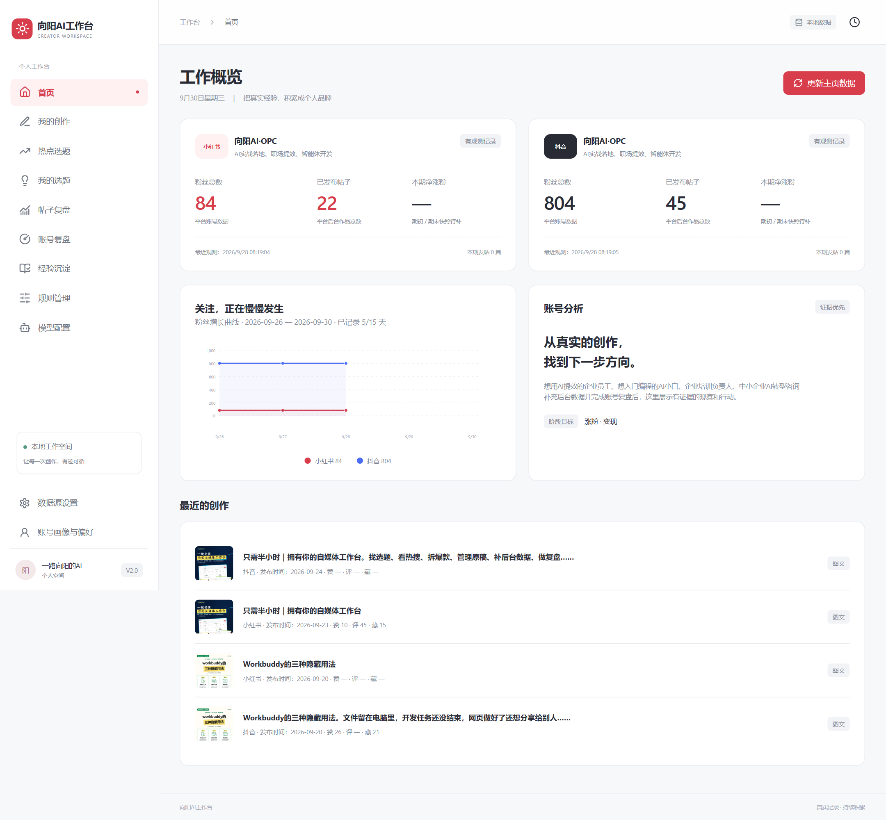
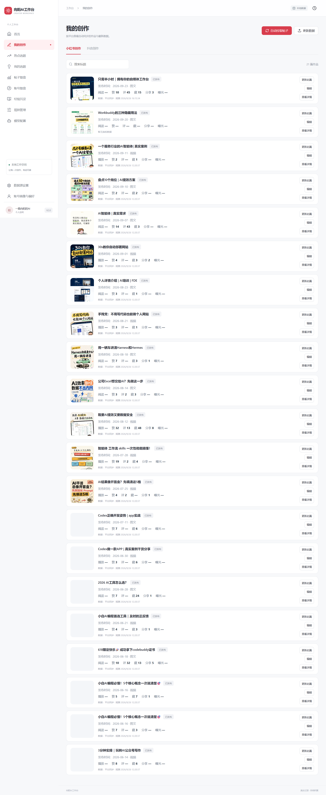
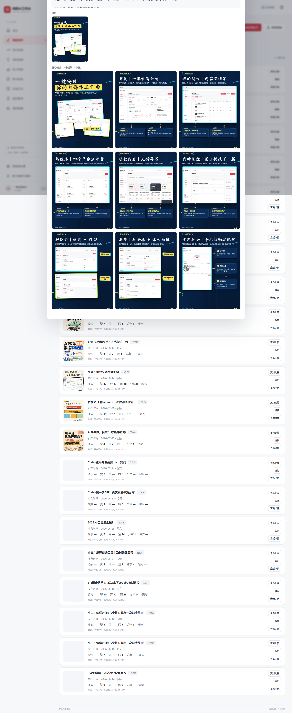
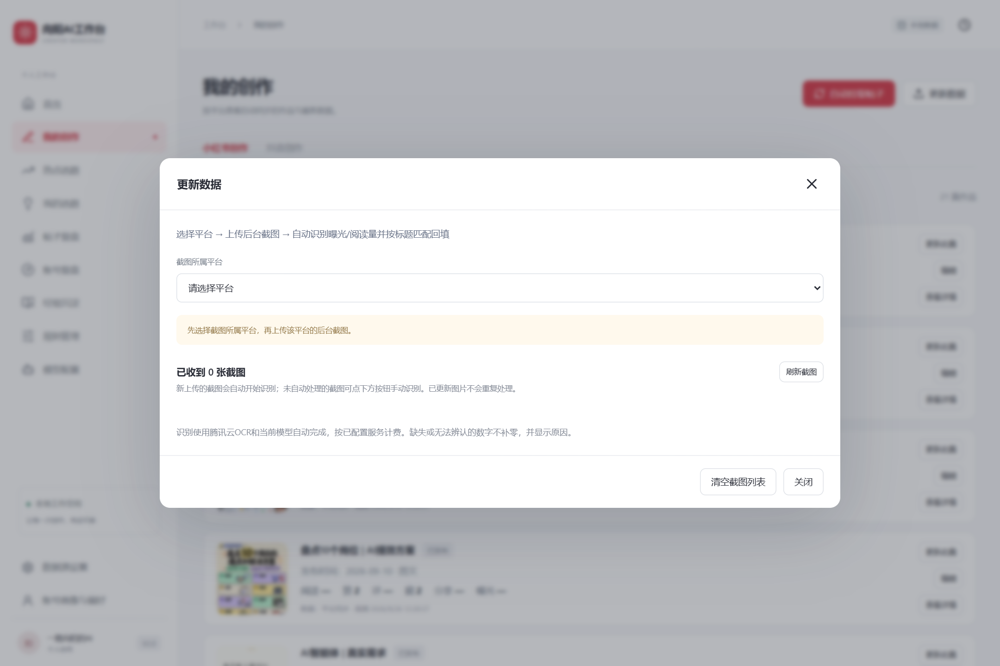
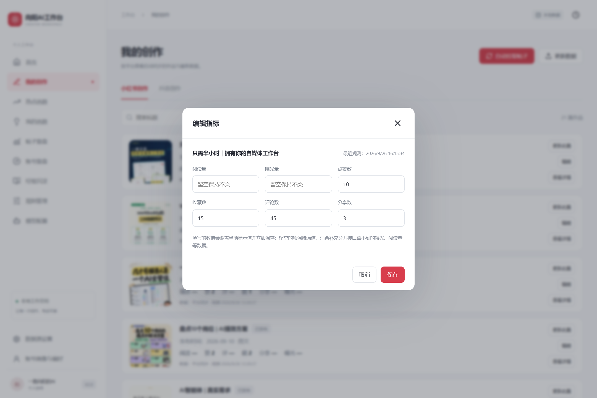
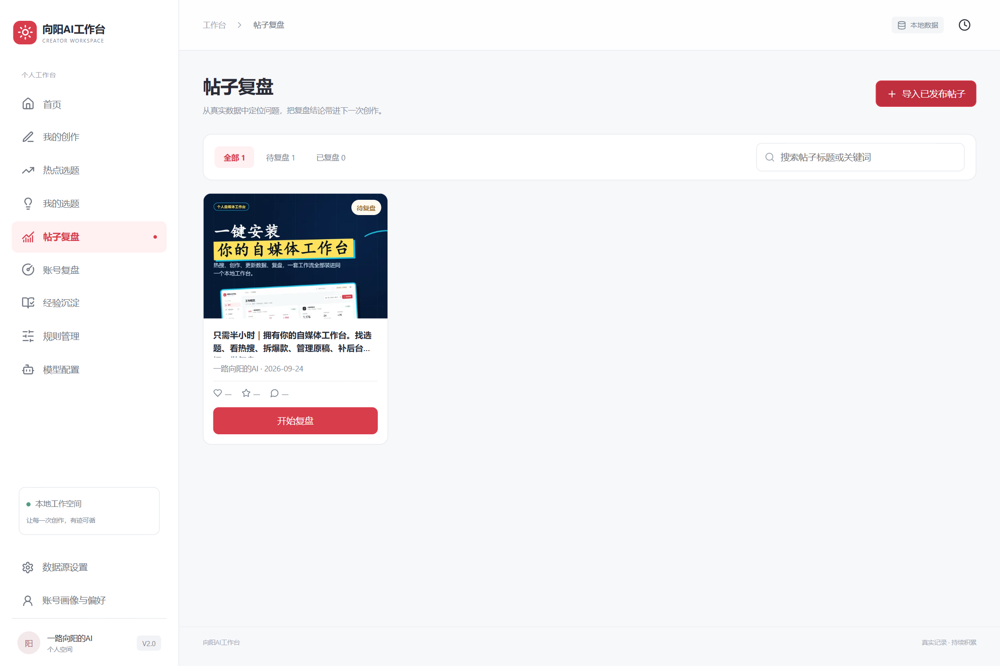
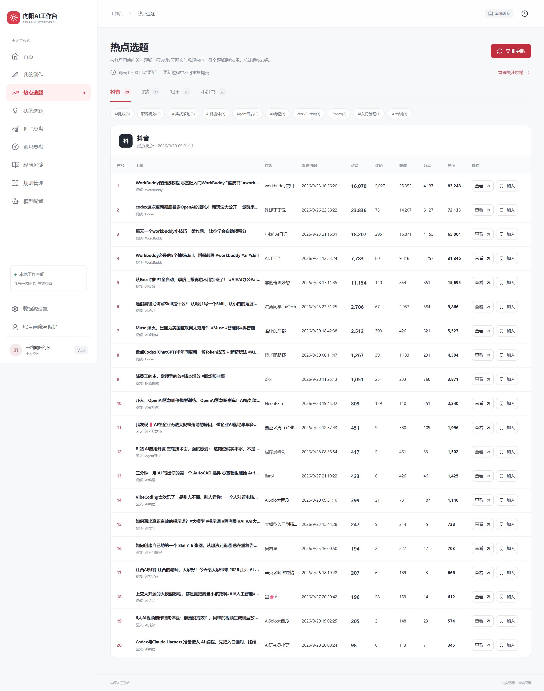
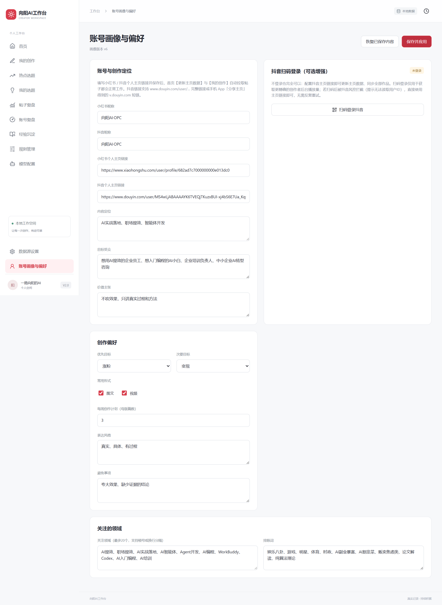

# 向阳AI工作台（Xiangyang Workspace）

本地优先的自媒体数据工作台：自动拉取 **小红书 / 抖音** 账号与作品数据，截图识别后台指标，AI 复盘内容表现。数据全部保存在你自己电脑上，密钥经 Windows DPAPI 加密存储，绝不上传。

> 仅支持 Windows 10/11（依赖 Windows 凭据保护 DPAPI 与本地文件锁）。

## 界面一览

| 首页 · 账号总览与粉丝增长曲线 | 我的创作 · 作品与指标 |
| --- | --- |
|  |  |

| 查看详情 · 标题 / 正文 / 封面 / 图片视频 | 更新数据 · 选平台 → 上传 → 自动识别回填 |
| --- | --- |
|  |  |

| 编辑指标 · 手动修正单篇数据 | 帖子复盘 · 导入 → 上传数据 → 生成报告 |
| --- | --- |
|  |  |

| 热点选题 | 账号画像与偏好 |
| --- | --- |
|  |  |

## 功能

### 数据采集

- **账号总览**：粉丝数、作品数一键更新 —— 填写小红书/抖音个人主页链接，通过 TikHub API 拉取公开数据（抖音扫码登录为可选增强，可读取创作者播放量）
- **我的创作**：全量/增量自动拉取已发布作品（标题、正文、封面、图片/视频），按篇同步平台详情，记录点赞、评论、收藏、分享等指标快照
- **更新数据**：选平台 → 上传后台截图（支持手机扫码上传）→ 腾讯云 OCR 自动识别曝光、阅读量等指标，按帖子标题 **90% 相似度自动匹配回填**，无需逐篇操作
- **编辑指标**：单篇帖子指标可手动编辑保存，留空项保持原值，保存后回显

### 分析复盘

- **粉丝增长曲线**：从首次观测日起逐日记录，15 天窗口自动滚动，悬停显示数值
- **帖子复盘**：导入已发布帖子 → 上传后台数据截图 → 大模型生成结构化复盘报告（问题定位 + 可执行建议），复盘完成自动锁定防重复
- **账号复盘**：阶段性的账号整体表现分析，结论回填首页「账号分析」卡片
- **经验沉淀**：把复盘结论积累为可复用的创作经验

### 选题支持

- **热点选题**：聚合多平台热搜与关注领域匹配，自动评分排序
- **我的选题**：基于账号画像生成选题建议
- **规则管理**：选题评分权重可视化调节（滑杆）

### 基础设施

- **截图数据录入**：手机扫码上传后台截图，OCR 自动识别指标
- **每日调用限额**：每个第三方服务可设每日上限，防止意外扣费
- **任务系统**：所有耗时操作（拉取、识别、复盘）后台执行，可查看进度、重试、取消

## 技术栈

| 层 | 技术 |
| --- | --- |
| 后端 | Python 3.11 · FastAPI · SQLite（标准库 sqlite3）· httpx |
| 前端 | React 19 · Vite 6 · TypeScript |
| 浏览器自动化 | Playwright（Chromium，抖音扫码登录可选） |
| 第三方 | TikHub（数据拉取）· 腾讯云 OCR · Codex SDK 兼容模型（大模型分析）· RedFox（热搜） |

## 安装

**零基础用户**：把 [INSTALL-PROMPT.md](INSTALL-PROMPT.md) 的全文复制给你的 AI 助手（WorkBuddy / TraeWork / Codex 等），它会自动完成安装并在桌面创建快捷方式。

**手动安装**（Windows，需 Python 3.11+ 与 Node.js 20+）：

```powershell
git clone https://github.com/bestwangjing/xiangyang-workspace.git
cd xiangyang-workspace
python -m venv .venv
.venv\Scripts\pip install -r requirements.lock.txt
npm ci
npm run build                 # 产出 web-dist/
npx playwright install chromium   # 可选，仅抖音扫码登录需要
powershell -ExecutionPolicy Bypass -File scripts\start-workspace.ps1
```

浏览器会自动打开 `http://127.0.0.1:8766`。

## 首次配置

1. 进入 **账号画像与偏好**：填写小红书/抖音 **个人主页链接**（必须，这是数据拉取的方式）和昵称、内容定位
2. 进入 **数据源设置**，按需填入（均为可选，填了才有对应功能）：

| 服务 | 用途 | 获取方式 |
| --- | --- | --- |
| TikHub API Key | 小红书/抖音数据拉取 | [tikhub.io](https://tikhub.io) 注册获取 |
| 腾讯云 SecretId/SecretKey | 截图 OCR 识别 | 腾讯云控制台开通 OCR 服务 |
| 模型配置 | 大模型复盘分析 | Codex SDK 兼容任意模型端点 |

3. 回到首页点 **更新主页数据** → 我的创作点 **自动拉取帖子**，即可看到自己的全部作品

密钥保存后仅以 DPAPI 密文存在于本机 `%LOCALAPPDATA%`，仓库与数据库中都不含明文。

## 目录结构

```
backend/     FastAPI 服务（路由、数据层、帖子拉取、截图识别、复盘生成）
frontend/    React 单页应用源码（main.tsx / style.css / model-presets.ts）
scripts/     启动脚本、抖音扫码登录、README 截图脚本
tests/       Pytest 测试套件（102 项，含 API 拉取解析回归）
docs/        界面截图等文档资产
web-dist/    前端构建产物（npm run build 生成，不入库）
```

## 数据保存位置

数据根目录按以下优先级确定：

1. 项目根目录 `.data-root.local` 文件内容（本机覆盖，不入库）
2. 环境变量 `XIANGYANG_DATA_ROOT`
3. 默认 `%LOCALAPPDATA%\XiangyangWorkspace`

## 开发

```powershell
.venv\Scripts\python -m pytest tests -q      # 后端测试（102 项）
npm run build                                # 前端构建（含 tsc 类型检查）
node scripts/readme-screenshots.mjs          # 更新 README 截图（需服务运行中）
```

## 常见问题

- **双击桌面快捷方式没反应**：查看 `runtime-logs\server.err.log`；若提示 Python 缺失，说明 `.venv` 未创建，重跑安装步骤。
- **端口 8766 被占用**：任务管理器结束旧的 `python.exe`，或修改环境变量 `XIANGYANG_PORT` 后重启。
- **抖音扫码登录失败**：重新扫码即可；登录会话 10 分钟内有效，扫码后请等待 1-2 分钟让脚本读取账号信息。扫码仅为可选增强，主页链接 + TikHub 模式不受影响。
- **截图匹配不到帖子**：标题相似度需 90% 以上；若截图标题被截断，可在「我的创作」中用「编辑」手动录入指标。
- **TikHub 报“今日调用上限”**：设置 → 数据服务 中调高每日上限（默认按服务方计费谨慎设置）。

## 许可

[MIT License](LICENSE) — 任何人可自由使用、修改、分发本软件（包括商业用途），只需保留原版权声明。欢迎基于本项目二次开发，期待你的 Star 与反馈。

**使用第三方服务须知**：本项目调用 TikHub、腾讯云 OCR 等第三方服务，使用时请自行遵守相应服务方的条款与计费政策；各平台数据的采集与使用请遵守平台服务条款。
